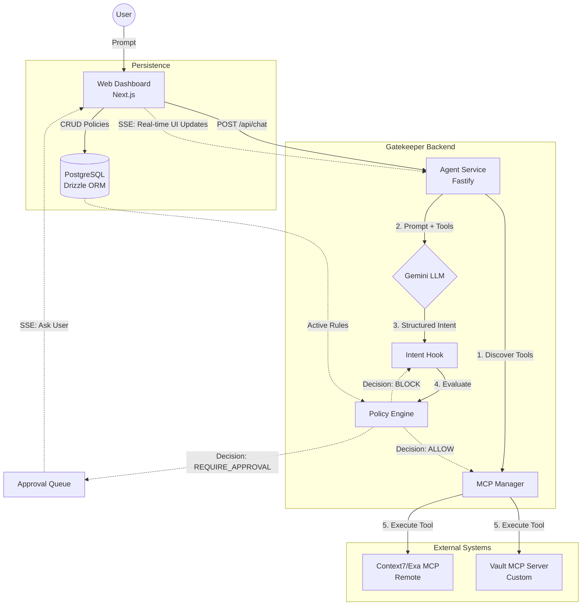

# Gatekeeper

Gatekeeper is a secure, policy-driven environment for AI agents. It enforces strict, cryptographically-inspired behavior control at the **intent layer** before any tool execution occurs. 

By sitting between a Large Language Model (LLM) and its connected Model Context Protocol (MCP) servers, Gatekeeper ensures that agents can only perform actions authorized by dynamic, real-time guardrails.

---

## High Level Design (HLD)

The architecture strictly decouples the Agent logic, the Policy Engine, and the MCP Transport.

---

## Core Components & How They Work

### 1. AI Agent Service (`apps/agent-service`)
The Fastify backend acts as the orchestrator.
- **Dynamic Tool Discovery:** Tools are never hardcoded. On startup and during execution, the `McpManager` queries all connected MCP servers (local and remote) to fetch their latest tools and JSON schemas.
- **The Intent Hook:** When the LLM decides to use a tool, it outputs a structured JSON intent. Instead of executing it immediately, the agent pauses and passes this `ToolExecutionIntent` to the Policy Engine.

### 2. Policy Engine (`packages/policy-engine`)
The heart of Gatekeeper. It is a completely isolated module that evaluates intents against database-backed guardrails.
- **Real-Time Rules:** Changes made in the dashboard write to the database and instantly propagate to the running engine without restarting the server.
- **Rule Types Supported:**
  - **Block/Allow:** Banning tools (e.g., `delete_*`).
  - **Namespace Validation:** Enforcing regex on arguments (e.g., must be `prod/*`).
  - **Human-in-the-Loop:** Forcing `REQUIRE_APPROVAL` for high-risk actions.
  - **Token Budgets:** Tracking conversation token usage and blocking execution if limits are exceeded.

### 3. Policy Dashboard (`apps/web`)
A Next.js dashboard where admins configure rules.
- **Real-Time SSE:** Chat interfaces use Server-Sent Events to render tool execution intents instantly. When a tool requires approval, the UI renders a live countdown timer and action buttons to approve or reject the request.

### 4. Custom Vault MCP Server (`apps/vault-mcp`)
A custom-built Model Context Protocol server that exposes secrets management capabilities (e.g., `get_secret`, `rotate_secret`). It is perfectly plug-and-play and seamlessly integrates with the agent's dynamic discovery loop.

---

## Request Lifecycle: Prompt to Final Result

1. **User Prompt:** The user sends a prompt via the chat UI.
2. **LLM Invocation:** The Agent sends the prompt plus the dynamically discovered MCP tools to the Gemini LLM.
3. **Intent Generation:** The LLM decides to call a tool (e.g., `rotate_secret(namespace="prod")`) and outputs a structured intent.
4. **Policy Evaluation:** The Agent passes the intent to the `PolicyEngine`. The engine checks the live rules in the DB.
5. **Decision Routing:**
   - **ALLOW:** The tool is routed to the MCP server for execution.
   - **BLOCK:** Execution is skipped, and a safe failure message is injected into the LLM context.
   - **REQUIRE_APPROVAL:** The loop pauses and an SSE event is sent to the dashboard. If the human approves, execution proceeds. If they reject (or ignore the prompt for 5 minutes), the intent is treated as blocked.
6. **LLM Synthesis:** The LLM receives the tool's result (or the block reason), analyzes it, and streams a final natural language response back to the user.

---

## Edge Cases & Resiliency Design

Gatekeeper is designed with fault tolerance and strict security hierarchies in mind.

### What happens when an MCP server crashes mid-tool-call?
The system utilizes robust error handling at the Fastify transport layer. If an MCP server crashes or times out, the backend catches the network exception. Instead of crashing the entire agent service, it wraps the error in a safe string (`"Tool execution failed: Server unreachable"`) and feeds it back to the LLM. The LLM can then apologize to the user or attempt an alternative tool.

### What happens when the agent tries to bypass a guardrail via prompt injection?
Gatekeeper is immune to prompt injection bypasses because the policy layer operates entirely outside the LLM. We enforce behavior cryptographically at the **intent layer**. Even if a user jailbreaks the LLM into attempting a banned action, the LLM has no direct execution privileges. It can only output a structured JSON intent, which the Policy Engine intercepts and unconditionally blocks based on hardcoded DB rules. The LLM cannot "talk" its way past the engine.

### What happens when two guardrail rules conflict?
The Policy Engine implements a strict **"Most Restrictive Wins" (Deny-by-default)** conflict resolution strategy.
If an intent matches multiple rules of the same priority, the rules are evaluated using this hierarchy: `BLOCK > REQUIRE_APPROVAL > ALLOW`. For example, if one wildcard rule allows all tools, but a specific rule blocks a particular tool, the Block rule takes absolute precedence. This ensures security constraints cannot be accidentally downgraded.

### What happens when a tool needs human approval but the approver is offline?
Gatekeeper's `ApprovalQueue` implements an automatic fallback mechanism. When an approval is requested, a 5-minute timeout timer (configurable via environment variables) begins on the backend. If no human clicks "Approve" or "Reject" before the timer expires, the queue automatically resolves the request as `EXPIRED`. This acts identically to a `BLOCK` decision. The LLM loop unblocks, is informed that the request timed out, and notifies the user. The dashboard UI also reflects this with a clear "TIMED OUT" state to prevent confusion.
